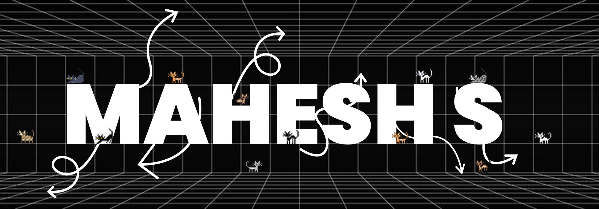

<h1 align="center">Hello World! 🌎, I'm Mahesh</h1>
<h3 align="center">🚀 Web Developer | Tech Enthusiast | Exploring Open-Source</h3>

## 👨🏻‍💻 &nbsp;About Me
💡 &nbsp;I enjoy exploring new technologies and building scalable, user-centric web applications. 
📠&nbsp;I'm currently pursuing a **Bachelor of Engineering in Computer Science**. 
🌱 &nbsp;Currently focused on **enhancing maintainability and performance using TypeScript and modern front-end frameworks**. 
✍️ &nbsp;Passionate about **creating intuitive interfaces and solving real-world problems** through efficient coding and best practices. 
💬 &nbsp;Feel free to reach out for **collaboration, discussions, or mentorship**. 
📄 &nbsp;Check out my **[GitHub](https://github.com/Maheshh-S)** | **[Portfolio](https://mahesh-s.vercel.app/)** | **[LinkedIn](https://linkedin.com/in/maheshh-s)**. 

---

## 🔥 **Currently Working On**
- **Revamping my portfolio with Next.js, Tailwind CSS, and Framer Motion.**
- **Exploring Open-Source, AI & Web3 technologies.**
- **Sharpening my DSA & Problem-Solving skills.**

---

## 🛠 **Tech Stack**

**💻 Frontend**

  
  
  
  
  

**🛠 Backend & Databases**

  
  
  
  
  

**🛠 DevOps & Tools**

  
  
  
  

---

## ⚙️ **GitHub Analytics**

---

## 🤝 **Connect with Me**

---

<b>🚀 Always Learning, Always Building!</b>

<i>Last Edited on: 17-02-2025</i>

